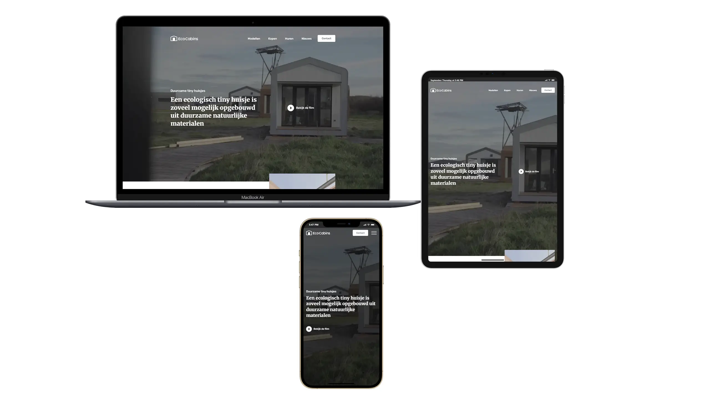

# Eco Cabins

**Role:**  
Front-End Developer | Responsive Design | JavaScript Interactivity | Popups  

🌐 [View Live Project](https://oleksandrmul.github.io/eco-cabins/)

---

## Overview  
Created a clean and minimalist **one-page website** for a business specializing in eco-friendly tiny houses built from sustainable materials. The goal was to present the product in a **clear, engaging, and conversion-focused way**, allowing visitors to quickly explore information and place an order.  

---

## Key Achievements  
- ✅ Implemented **smooth scroll navigation**, **hover animations**, and a **JavaScript-powered burger menu** for intuitive interaction.  
- ✅ Integrated **Swiper sliders** to showcase content efficiently without overwhelming users.  
- ✅ Designed and developed fully **custom popups** using JavaScript, including contact forms and a video presentation modal on the homepage.  
- ✅ Focused on **responsive design**, ensuring the layout adapts seamlessly to all screen sizes.  
- ✅ Followed **best practices** for semantic HTML5, SCSS structuring, and mobile-first development.  

---

## Outcome  
The result is a **lightweight, visually appealing landing page** that highlights the eco-friendly concept while remaining simple and user-focused. The inclusion of custom-styled popups and integrated video presentation adds interactivity and professionalism, helping the business connect with potential customers more effectively.  

---

## Conclusions  
The landing page combines **minimalist design and interactive features** to present eco-friendly homes in a professional, engaging way. Custom popups and video integration enhance user trust and drive conversions.  

If you’re looking for a **developer who can deliver functional, responsive, and business-driven web solutions**, let’s connect and make your project a success 🤝.  
